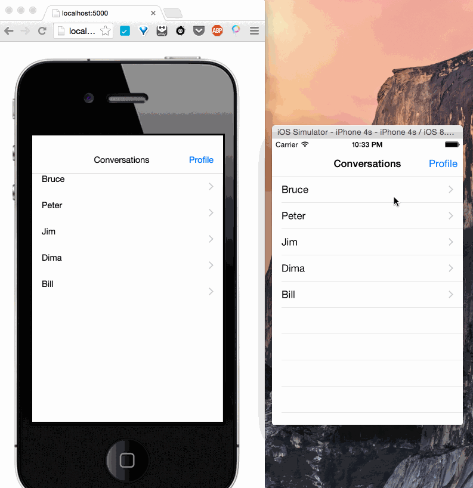

# BetterContent Server and Web Client
Dead simple webpage to edit any iOS app in runtime:



__Work in progress.__

## Installation
 - install [node](http://nodejs.org/)
 - clone this repository
 - run `npm install` to install all the project's dependancies

## Running locally
- run `gulp` in your command line.
- open your browser at http://localhost:5000

## The Native Client
In order too see anything in the browser (after you run it) you need an iOS native app that communicates with the server. By default, an iOS app with [BetterContent](https://github.com/gardenofwine/better-content-client-ios) installed communicates with the [public server instance](http://bettercontent.herokuapp.com). If you want to run the native app against your local server,
edit the server host in your xcode project by editing  `BTCConstants.h` 

## Implementation details

This repository contains the code for:
 1. The server coordinating between an iOS BetterContent enabled application to the BetterContent web application. (Communication is done via [einaros/ws](http://einaros.github.io/ws/) WebSockets implementation.)
 1. The BetterContent web application.

## Running on Heroku

``` bash
heroku create
git push heroku master
heroku open
```

## TODOS

 1. Support text areas (refactor UIView handling)
 1. Support multiple dimension iOS (iPads, iPhone5, iPhone6)
 1. Create an Heroku template for easy cloning.
 1. Add all licenses of used libraries: bootstrap, node, jade, gulp, websockets (ws)

# Copyright
Copyright (c) 2014-2015 Benny Weingarten-Gabbay.

MIT License. See [LICENSE](LICENSE) for details.
